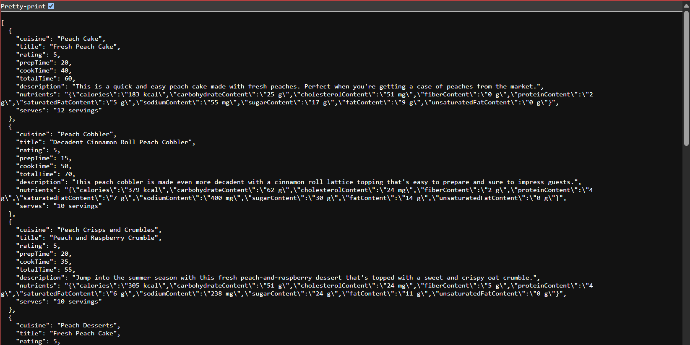
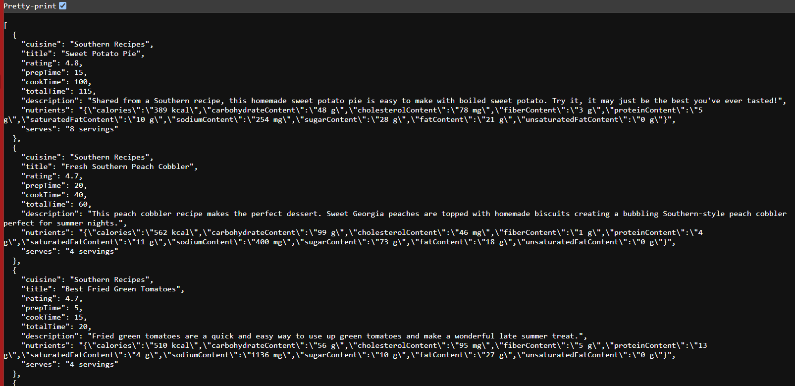
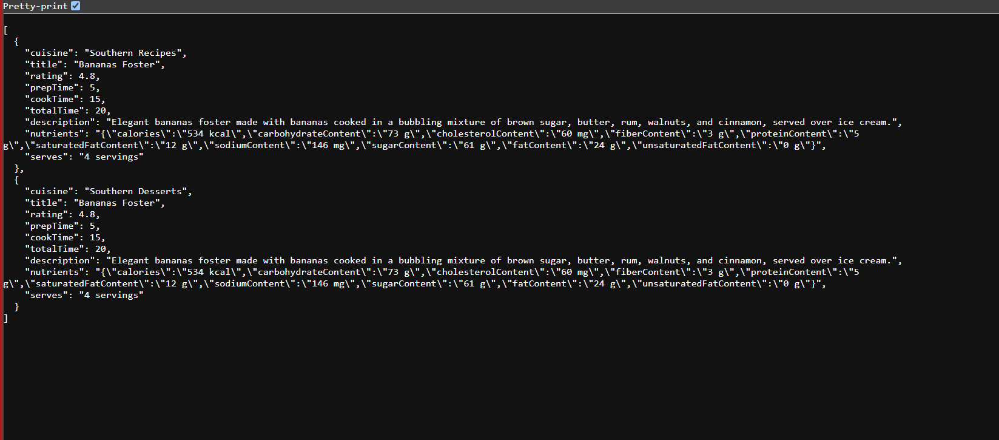
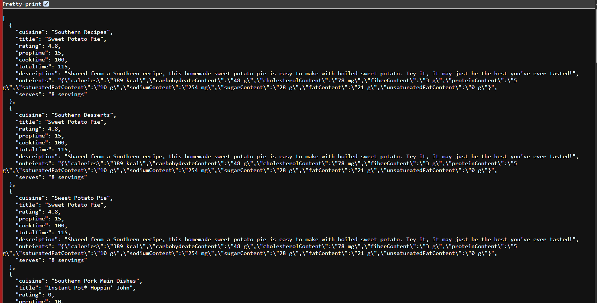

# Recipe API Development Project

## Overview
This project was developed as part of a placement round for **Securin**.
The task involved:
- Parsing a large, nested JSON file (`recipe.json`, ~8,000 records)
- Extracting specific attributes
- Storing the processed data into a **PostgreSQL** database programmatically
- Exposing the stored data as REST APIs using **Spring Boot**
- Supporting pagination, sorting, and custom queries through API endpoints

The goal was to demonstrate end-to-end API development — from data ingestion to querying and exposing endpoints.

## Tech Stack

| Component        | Technology Used |
|-----------------|----------------|
| Backend         | Java, Spring Boot |
| Database        | PostgreSQL |
| IDE             | Eclipse |
| Build Tool      | Maven |
| API Testing     | Postman (for demonstration) |
| Other Libraries | fasterxml.jackson to manage JSON data |

## Features
- JSON Parsing – Reads and parses `recipe.json`, extracts required attributes programmatically
- Database Integration – Inserts parsed data into PostgreSQL (no manual imports)
- REST Endpoints – Exposes CRUD APIs for accessing recipes
- Pagination & Sorting – Supports query params like `page`, `size`, `sort`
- Custom Queries – Example: search by recipe name, category, or ingredient
- Error Handling – Graceful handling of invalid inputs and missing data

## Project Structure

```
src/main/java/com/example/recipeapi
│
├── controller       # REST Controllers
├── dto             # Data Transfer Objects
├── entity          # JPA Entities
├── repository      # Spring Data JPA Repositories
├── service         # Business Logic
└── util            # JSON Parser Utility
```

## Getting Started

### Prerequisites
- Java 17+
- Maven 3+
- PostgreSQL running locally or remotely

### Setup Database
Create a new database in PostgreSQL:

```sql
CREATE DATABASE recipe_db;
```

Update the database credentials in `application.properties`:

```properties
spring.datasource.url=jdbc:postgresql://localhost:5432/recipe_db
spring.datasource.username=your_username
spring.datasource.password=your_password
spring.jpa.hibernate.ddl-auto=update
spring.jpa.show-sql=true
```

### Endpoint Examples

1)	View all the data – pagination (0, 10) – sorted according to rate
http://localhost:8080/api/recipes/0/10




2)	Search and filter:
http://localhost:8080/api/recipes/search/rating?rating=4.5




http://localhost:8080/api/recipes/search/calories?calories=389%20kcal




http://localhost:8080/api/recipes/search/totaltime?time=150




